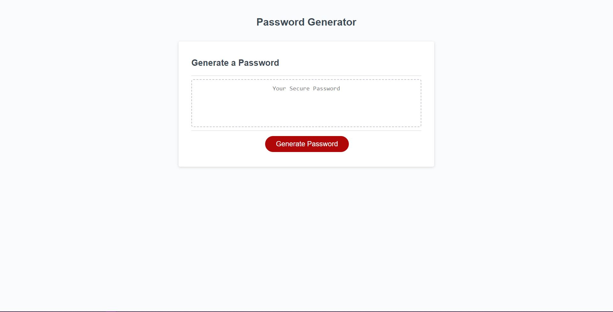

# < Password Generator >

## Description

Everyone is worried about cybersecurity, when one stores so much sensitive data on the internet security is in high demand. Personally I struggle with making good passwords for various accounts. But worry no longer, if you want a free secure password I have devised just the thing! This free password generator will create a password for you! From lengths of 8 to 128 characters, and with many options to choose between! You can have upper or lowercase letters, numbers, symbols, all four, or mix and match to what suits your specific password need! I hope you enjoy.
## Usage

 Just click the Generate Password button and let your computer do the work for you!

[Live site right here!](https://shadowasders.github.io/Password-Generator/)

## Credits

I'd like to thank my instructors [Anthony Maddatu](https://github.com/amaddatu) and Andrew Reed (Github unavailable) for helping me begin to understand the building blocks of Javascript!

## License

